# 🚗 Software & Systems Test Automation Specialist | Automotive Integration Expert

👋 Hi, I’m a Senior Test Automation & Integration Engineer with a deep passion for advancing automotive safety, reliability, and intelligent mobility. My expertise spans the full spectrum of automotive domains—ADAS, Battery Management Systems (BMS), Instrument Panel Clusters (IPC), and Braking Systems—where I deliver robust, scalable solutions for system validation and integration.

## 💡 What I Do Best

```mermaid
mindmap
  Expertise((🧑‍🔬))
    SystemTest["🕵 system test"]
    SoftwareTest["🕵 software test"]
    SoftwareIntegration["🔄 software integration"]
    Automation["🤖 automation"]
```

- **Test Automation & Frameworks:** Architecting reusable, Python-driven automation frameworks and Hardware-in-the-Loop (HiL) environments to accelerate validation and ensure quality.
- **Continuous Integration:** Building and optimizing CI/CD pipelines (Jenkins) for rapid, automated testing and seamless release cycles.
- **Automotive Diagnostics & Communication:** Mastery of UDS, DoIP, and CAN protocols, with hands-on experience in ECU diagnostics, fault injection, and network management.
- **Integration Testing & Validation:** Leading multi-ECU integration, cross-functional system validation, and compliance with ISO 26262 and Automotive SPICE standards.
- **Virtual & Simulation Environments:** Creating Software-in-the-Loop (SiL) and simulation setups to emulate real-world scenarios, especially for ADAS and next-gen vehicle technologies.

## 🛠️ Technical Toolbox
- **Languages:** Python, CAPL
- **Tools:** Vector tools (CANalyzer, CANape), Jenkins, Github Actions, Git, CMake
- **Protocols:** CAN, UDS, DoIP
- **Methodologies:** Agile, V-model, Test-Driven Development (TDD), Behavior-Driven Development (BDD)

## 🚀 My Mission

Driven by a commitment to safer, smarter vehicles, I combine innovative automation strategies with rigorous validation to enhance embedded automotive systems. I’m always exploring new technologies and best practices to deliver solutions that meet the highest standards of quality and safety.

## My open source GitHub Projects

- [py_canoe](https://github.com/chaitu-ycr/py_canoe.git)
- I am maintaining some of my learnings 🤓 📗 here 👉 [🔗 automotive-test-kit/docs](https://github.com/chaitu-ycr/automotive-test-kit/tree/main/docs)
- All GitHub repositories created by me [🔗 click here](https://github.com/chaitu-ycr?tab=repositories)

---

  <a href="https://www.google.com/search?q=automotive-test-kit">Google 🔍</a>&nbsp;&nbsp;&nbsp;&nbsp;
  <a href="https://www.youtube.com/@automotive-test-kit">YouTube ▶️</a>&nbsp;&nbsp;&nbsp;&nbsp;
  <a href="https://pypi.org/user/chaitu.ycr/">PyPI 📦</a>&nbsp;&nbsp;&nbsp;&nbsp;
  <a href="https://www.linkedin.com/in/automotive-test-kit/">LinkedIn</a>&nbsp;&nbsp;&nbsp;&nbsp;
  <a href="https://github.com/chaitu-ycr">GitHub</a>

---
