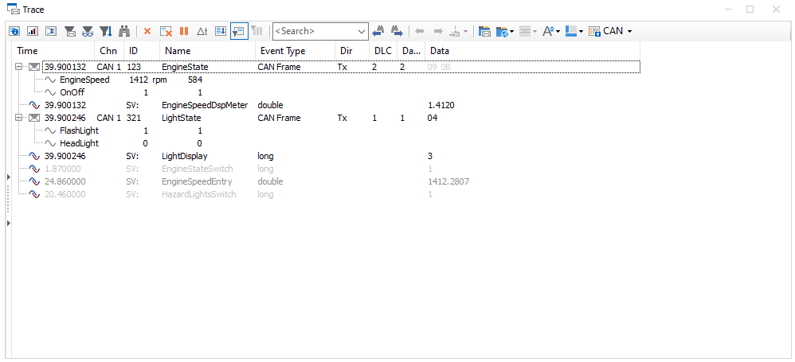
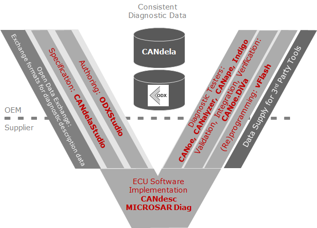

# Vector CANoe 🛶

## What is it? 🤔

CANoe (CAN Open Environment) is a comprehensive software tool developed by Vector for the development, testing, and analysis of distributed systems. It is not limited to just CAN buses, but also supports many other networks such as LIN, Ethernet, FlexRay, and MOST. CANoe is considered the de facto standard in the automotive industry for working with ECU networks.

## Why do we use it? 🤷‍♂️

CANoe is an all-in-one solution that helps engineers to:

*   **Design and simulate networks:** You can simulate an entire vehicle network, even before any physical hardware exists.
*   **Perform detailed analysis:** It has all the analysis capabilities of CANalyzer, allowing you to monitor and interpret bus traffic.
*   **Systematic testing:** CANoe has a built-in test suite that allows you to design and execute automated tests.
*   **Diagnostics:** It supports diagnostic protocols (such as UDS), allowing you to request diagnostic information from ECUs and analyze the responses.
*   **Collaboration:** CANoe allows different teams to work on the same configuration, streamlining the development process.

## Core Concepts 💡

### Simulation Concept

The core of CANoe is its simulation capability. You can create a "rest bus" simulation, where CANoe simulates all the ECUs that communicate with your real ECU under test.

*   **What:** It creates a virtual network environment.
*   **Why:** It allows you to test ECUs even in the absence of hardware.
*   **How:** The network details (nodes, messages, signals) are defined in a database (*.dbc). CANoe then uses this database to simulate the behavior of these nodes.

### Analysis Concept

CANoe has powerful analysis features to help you understand what is happening on the network.

*   **Trace Window:** Shows all messages on the bus in real-time.

*   **Graphic Window:** Plots signal values over time.

*   **Bus Statistics Window:** Shows network statistics such as bus load and error rate.

### Test Concept

CANoe has an integrated testing environment. You can create test modules using CAPL, XML, or C#.

*   **What:** It allows for the creation and execution of automated test cases.
*   **Why:** This is essential for regression testing and for ensuring that the ECU meets its requirements.
*   **How:** The test modules are designed to stimulate the ECUs and check their responses. The results are logged in a detailed report.

### Diagnostics Concept

CANoe supports diagnostic protocols, allowing you to communicate with an ECU as a diagnostic tester.

*   **What:** It allows you to send diagnostic requests and analyze the responses.
*   **Why:** This is critical for diagnosing faults and for checking the status of the ECU.
*   **How:** You can send requests manually using the Diagnostic Console or integrate diagnostic services into automated tests.

## Real-world example 🌍

Imagine a team developing an Instrument Panel Cluster (IPC). They can use CANoe to:
1.  **Simulate:** All the other ECUs, such as the engine, transmission, and ABS controllers.
2.  **Analyze:** Verify that the IPC is correctly interpreting the CAN messages for engine speed and vehicle speed.
3.  **Test:** Run automated tests to ensure that the IPC illuminates the correct warning light when a simulated "check engine" message is sent.
4.  **Diagnose:** Read the diagnostic fault codes from the IPC to ensure that it correctly reports any internal errors.

## Mind Map Overview 🧠

```mermaid
mindmap
  root((CANoe))
    (What is it?)
      :A comprehensive development, testing, and analysis tool for distributed systems;
    (Concepts)
      (Simulation)
        :Rest bus simulation;
      (Analysis)
        :Trace, Graphic, Statistics windows;
      (Test)
        :Automated test modules;
      (Diagnostics)
        :UDS and other protocols;
    (Real-world example)
      :Developing and testing an Instrument Panel Cluster;
```
