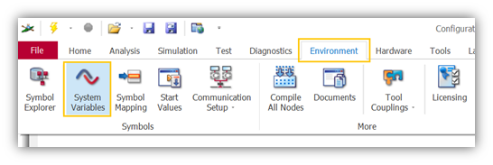

# Using Vector VN Hardware I/O Piggies in Automotive Testing 🔌

## What is it? 🤔

Many Vector network interfaces (like the VN16xx series) come with a small connector for digital and analog I/O. This is often called an "I/O piggy" (short for piggyback board). It allows you to measure voltages and control digital signals directly from your CANoe/CANalyzer setup, which is incredibly useful for testing ECUs.

This guide focuses on the I/O capabilities of the **VN1630A**.

## Features of the VN1630A I/O ✨

*   **1 Analog Input:**
    *   Range: 0V to 18V
    *   Resolution: 10 bit
    *   Sampling Rate: 1kHz
*   **1 Digital Output:**
    *   Type: Open Drain
    *   External Supply: Up to 32V
    *   Max Current: 500mA
*   **2 Digital Inputs:**
    *   Range: 0V to 32V
    *   Schmitt trigger (High > 2.7V, Low < 2.2V)

## Required Hardware & Software 🛠️

*   A Vector network interface with an I/O piggy (e.g., VN1630A).
*   Vector CANoe or CANalyzer software.
*   A DB9 male connector to create a custom cable.
*   A 12V relay (for controlling loads > 500mA on the digital output).
*   A power supply.

## How to Configure the I/O in CANoe 👨‍🔧

1.  **Open CANoe Configuration.**
2.  Go to the **Hardware** tab.
3.  Click on **Vector I/O**.
4.  Select your hardware (e.g., VN1630A IO) and set the **Mode** to **Standard**.

## How to Use the I/O Signals 🕹️

Once configured, CANoe automatically creates system variables that you can use to interact with the I/O channels.

*   You can find these variables under: `Environment` -> `System Variables` -> `System-Defined` -> `IO` -> `VN1600_1`.
*   **To read an input:** Simply read the value of the corresponding system variable (e.g., `IO::VN1600_1::AIN_1` for the analog input).
*   **To control an output:** Set the value of the corresponding system variable (e.g., set `IO::VN1600_1::DOUT_1` to `1` to activate the digital output).

## Real-world Example: Testing a "Terminal 15" Input 🌍

**Scenario:** You want to test an ECU that should only perform a certain action when the ignition (Terminal 15) is on.

**Problem:** You need to simulate the ignition signal for the ECU.

**Solution:**

1.  **Hardware Setup:**
    *   Connect the digital output of the VN1630A to the "Terminal 15" input pin of the ECU.
    *   You might need a relay in between if the ECU's ignition input draws more than 500mA.
2.  **CANoe Setup:**
    *   In your CANoe test module (e.g., a CAPL script), you can now control the ignition signal by changing a system variable.
    *   `@IO::VN1600_1::DOUT_1 = 1;` // Simulates ignition ON
    *   `@IO::VN1600_1::DOUT_1 = 0;` // Simulates ignition OFF
3.  **Test Execution:**
    *   Your test case can now automatically turn the "ignition" on and off and check if the ECU behaves as expected (e.g., starts sending certain CAN messages only when the ignition is on).

## Mind Map Overview 🧠

```mermaid
mindmap
  root((Vector HW I/O Piggy))
    (What is it?)
      :I/O channels on Vector network interfaces;
      :Example: VN1630A;
    (Features)
      :Analog Input;
      :Digital Output;
      :Digital Inputs;
    (How to Configure)
      :CANoe Hardware tab;
      :Select Vector I/O;
    (How to Use)
      :Auto-generated System Variables;
      :Read for inputs;
      :Set for outputs;
    (Real-world Example)
      :Simulating an ignition signal (Terminal 15) for an ECU test;
```
